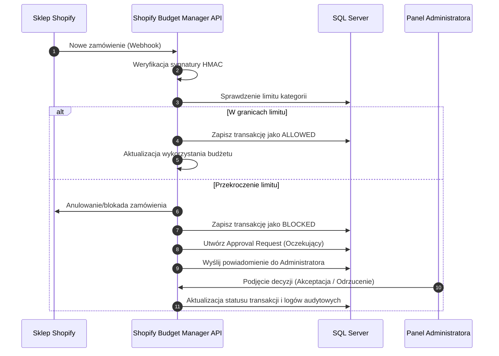

# 🛍️ Shopify Budget Manager

[](https://dotnet.microsoft.com/)
[](https://vuejs.org/)
[](https://vitejs.dev/)
[](https://tailwindcss.com/)
[](https://www.microsoft.com/sql-server)
[](https://deepmind.google/technologies/gemini/)

**Shopify Budget Manager** to nowoczesna i zaawansowana aplikacja webowa zaprojektowana do ścisłej kontroli wydatków w działalności e-commerce. Dzięki bezpośredniej integracji z platformą Shopify, system umożliwia monitorowanie transakcji w czasie rzeczywistym, zarządzanie limitami budżetowymi dla różnych kategorii oraz automatyczne blokowanie zamówień naruszających politykę finansową firmy.

Aplikacja jest zintegrowana z **Google Gemini API**, pełniącym rolę inteligentnego asystenta finansowego, który analizuje trendy wydatków i generuje prognozy na koniec miesiąca.

---

## 🛠️ Architektura i Stack Technologiczny

Aplikacja została zbudowana w architekturze rozdzielonego backendu i frontendu (SPA):

### Backend (`/backend`)
*   **Framework:** ASP.NET Core 10.0 Web API.
*   **Dostęp do danych:** Entity Framework Core (Code First).
*   **Baza danych:** Microsoft SQL Server.
*   **Uwierzytelnianie:** JWT (JSON Web Tokens) oraz autoryzacja oparta na rolach (Role-Based Authorization).
*   **Integracje:** ShopifySharp (do integracji z Shopify Admin API), weryfikacja podpisów HMAC dla Webhooków Shopify, Google Gemini API.
*   **Biblioteki pomocnicze:** AutoMapper, FluentValidation.

### Frontend (`/frontend`)
*   **Framework:** Vue 3 (Composition API) z narzędziem budującym Vite.
*   **Zarządzanie stanem:** Pinia.
*   **Stylizacja:** Tailwind CSS 4.0.
*   **Wizualizacja danych:** Chart.js (wykresy kołowe i liniowe w czasie rzeczywistym).
*   **Komunikacja z API:** Axios.

---

## ✨ Kluczowe Funkcjonalności

### 1. Integracja ze sklepem Shopify
*   Odbieranie i przetwarzanie zdarzeń w czasie rzeczywistym za pomocą webhooków (`orders/create`, `orders/paid`, `orders/cancelled`, `refunds/create`).
*   Bezpieczna weryfikacja autentyczności pakietów Shopify przy użyciu sygnatury HMAC.
*   Automatyczna synchronizacja historycznych zamówień.

### 2. Elastyczne Zarządzanie Budżetami
*   Definiowanie **budżetu globalnego** na dany miesiąc.
*   Tworzenie dedykowanych **limitów miesięcznych dla kategorii** (np. *Marketing*, *Software*, *Logistyka*, *Elektronika*).
*   Wizualne wskaźniki zużycia budżetów z automatycznym ostrzeganiem po przekroczeniu 80% limitu.

### 3. Approval Workflow (Przepływ Zatwierdzeń)
*   Automatyczne blokowanie (anulowanie) zamówień w Shopify, jeżeli ich wartość przekracza zdefiniowany limit dla danej kategorii.
*   Wstrzymanie transakcji i utworzenie żądania zatwierdzenia (**Approval Request**) w statusie oczekującym.
*   Dedykowany panel administracyjny umożliwiający akceptację lub odrzucenie wydatku wraz z dodaniem notatki uzasadniającej.

### 4. Inteligentny Asystent AI (Gemini)
*   Analiza aktualnych trendów wydatków jednym kliknięciem.
*   Generowanie inteligentnych prognoz kosztów na koniec miesiąca w oparciu o dotychczasowe tempo zakupów.
*   Rekomendacje dotyczące optymalizacji budżetów.

### 5. Logi Audytowe i Powiadomienia
*   Pełna historia operacji (**Audit Logs**) rejestrująca każde odebrane zdarzenie, decyzje administratora oraz kluczowe akcje w systemie.
*   Dynamiczny system powiadomień w czasie rzeczywistym z podziałem na poziomy krytyczności (informacje, ostrzeżenia, błędy/blokady).

---

## 📊 Przepływ Procesu Finansowego (Workflow)



---

## 👥 Zarządzanie Użytkownikami i Uprawnieniami

Aplikacja wspiera dwa typy kont z różnymi poziomami uprawnień:

| Rola | Uprawnienia |
| :--- | :--- |
| **User (Użytkownik)** | Przeglądanie Dashboardu, wykresów, historii transakcji i powiadomień. Zarządzanie własnymi limitami budżetowymi. Korzystanie z Asystenta AI. |
| **Admin (Administrator)** | Pełne uprawnienia użytkownika standardowego + zarządzanie wszystkimi budżetami, zatwierdzanie/odrzucanie zablokowanych wydatków (**Approval Workflow**), przegląd pełnych logów audytowych (**Audit Logs**). |

> 💡 **Wskazówka:** Każdy nowo zarejestrowany użytkownik otrzymuje domyślnie rolę **User**. Aby nadać rolę **Admin**, należy zaktualizować pole `Role` w tabeli `Users` w bazie danych SQL i zalogować się ponownie.

---

## 🚀 Szybki Start (Instrukcja Uruchomienia)

### Wymagania wstępne
*   **.NET 10.0 SDK** lub nowszy
*   **Node.js** (wersja 18+) oraz **npm**
*   **Microsoft SQL Server** (LocalDB lub pełna instancja)
*   *(Opcjonalnie)* Klucz API Google Gemini oraz konto partnerskie Shopify.

---

### Krok 1: Konfiguracja i Migracja Bazy Danych (Backend)

1.  Otwórz plik `backend/appsettings.json` i upewnij się, że połączenie z bazą danych w sekcji `ConnectionStrings` jest poprawne:
    ```json
    "ConnectionStrings": {
        "DefaultConnection": "Server=(localdb)\\mssqllocaldb;Database=ShopifyBudgetManagerDb;Trusted_Connection=True;TrustServerCertificate=True;"
    }
    ```
2.  Zainstaluj narzędzia Entity Framework Core (jeśli nie zostały wcześniej zainstalowane):
    ```bash
    dotnet tool install --global dotnet-ef
    ```
3.  W katalogu `backend/` wykonaj migrację bazy danych w celu utworzenia tabel:
    ```bash
    dotnet ef database update
    ```
4.  Uruchom aplikację backendową:
    ```bash
    dotnet run
    ```
    *API będzie dostępne pod adresem `http://localhost:5258`.*

---

### Krok 2: Instalacja i Uruchomienie (Frontend)

1.  Przejdź do katalogu `frontend/`.
2.  Zainstaluj wymagane zależności:
    ```bash
    npm install
    ```
3.  Uruchom serwer deweloperski frontendu:
    ```bash
    npm run dev
    ```
    *Aplikacja frontendowa będzie dostępna pod adresem `http://localhost:5173`.*

---

## ⚙️ Konfiguracja Integracji

W celu pełnego wykorzystania potencjału integracji, uzupełnij następujące sekcje w pliku `backend/appsettings.json`:

```json
{
  "Shopify": {
    "ApiSecret": "TWÓJ_SHOPIFY_API_SECRET",
    "ShopName": "twoj-sklep.myshopify.com",
    "AccessToken": "TWÓJ_SHOPIFY_ACCESS_TOKEN"
  },
  "Gemini": {
    "ApiKey": "TWÓJ_KLUCZ_API_GEMINI"
  }
}
```

*   **Weryfikacja Webhooków:** Aby weryfikować webhooki lokalnie, użyj narzędzia takiego jak **ngrok** do wystawienia swojego localhosta i skonfiguruj adres URL webhooka w panelu Shopify jako `https://<twoja-domena-ngrok>/api/webhooks/orders`.
