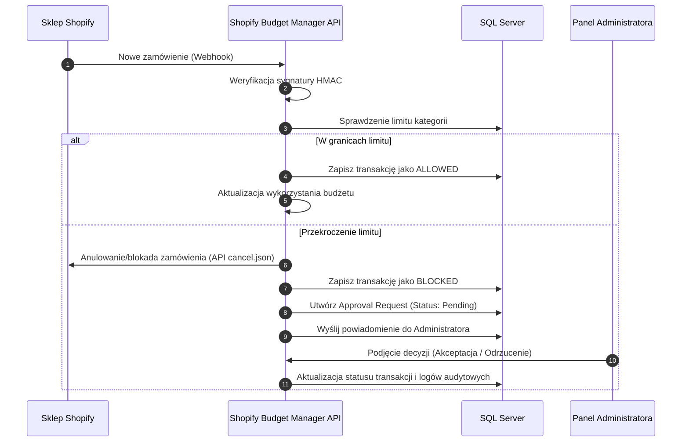

# 🤖 AI Prompt & Knowledge Context: Shopify Budget Manager

Ten plik stanowi kompletny opis systemu (Single Source of Truth) przeznaczony dla agentów AI pracujących nad rozwojem tej aplikacji. Zawiera on opis założeń biznesowych, grupy docelowej, przewag konkurencyjnych, pełnego workflow operacyjnego, schematu bazy danych, architektury technicznej oraz standardów kodowania.

---

## 🎯 1. Przeznaczenie Aplikacji i Grupa Docelowa (Dla kogo jest ten system?)

*Shopify Budget Manager* **nie służy** do kontrolowania zakupów, które firma robi w obcych sklepach internetowych. Jest to zaawansowany **system kontroli budżetowej i autoryzacji wydatków po stronie właściciela (administratora) sklepu Shopify**.

Aplikacja ma kluczowe znaczenie biznesowe w czterech głównych scenariuszach:

### A. Wewnętrzne zakupy korporacyjne (Corporate Procurement Portal)
*   **Dla kogo:** Średnie i duże przedsiębiorstwa posiadające działy wewnętrzne (IT, Marketing, HR, Administracja) i własny sklep Shopify pełniący funkcję katalogu zaopatrzeniowego.
*   **Problem:** Pracownicy mogą nadmiernie zamawiać sprzęt lub materiały marketingowe bez nadzoru finansowego.
*   **Rozwiązanie:** Pracownicy zamawiają materiały w znajomym środowisku Shopify. System Budget Manager automatycznie sprawdza ich limity i w razie przekroczenia anuluje zamówienie w Shopify, kierując wniosek do akceptacji menedżera.

### B. Limity kredytu kupieckiego B2B (Wholesale Credit Enforcement)
*   **Dla kogo:** Hurtownicy prowadzący sprzedaż B2B na platformie Shopify z odroczoną płatnością (np. Net 30/60).
*   **Problem:** Klienci hurtowi mogą składać zamówienia przekraczające ich zdolność kredytową.
*   **Rozwiązanie:** System automatycznie blokuje zamówienia hurtowe przekraczające indywidualny kredyt kupiecki przypisany do konta partnera, zapobiegając powstawaniu zatorów płatniczych.

### C. Kontrola wydatków sieci franczyzowych lub oddziałów (Franchise Procurement)
*   **Dla kogo:** Centrale sieci handlowych lub usługowych udostępniające sklep Shopify swoim franczyzobiorcom do zamawiania brandowanych opakowań, odzieży roboczej czy ulotek.
*   **Problem:** Konieczność sprawiedliwego i kontrolowanego przydzielania darmowych pakietów promocyjnych dla każdego oddziału.
*   **Rozwiązanie:** Centrala ustala limity budżetowe dla poszczególnych lokalizacji (kategorii) i blokuje zamówienia ponad przyznany limit finansowy.

### D. Bezpiecznik awaryjny dla automatyzacji (Automated Ordering Circuit Breaker)
*   **Dla kogo:** Sklepy zintegrowane z zewnętrznymi systemami ERP, dropshippingowymi lub importerami API, które automatycznie generują zamówienia hurtowe.
*   **Problem:** Błędy integracji (np. pętla nieskończona) mogą wygenerować tysiące zamówień w kilka minut, blokując zapasy magazynowe i generując prowizje dla bramek płatniczych.
*   **Rozwiązanie:** System natychmiast odcina integrację i anuluje nadmiarowe zamówienia po przekroczeniu krytycznego limitu globalnego.

---

## 💎 2. Przewaga Konkurencyjna Systemu (Dlaczego warto go używać?)

1.  **Kontrola proaktywna w czasie rzeczywistym:** Tradycyjne systemy ERP analizują koszty wstecznie (po wystawieniu faktury). Ten system działa **prewencyjnie** — blokuje i anuluje zamówienie w Shopify zanim zostanie ono fizycznie zrealizowane.
2.  **Brak oporu wdrożeniowego (Zero-Training):** Pracownicy nie muszą uczyć się skomplikowanych paneli zakupowych ERP. Robią zakupy przez standardowy koszyk Shopify, który doskonale znają.
3.  **Lekka alternatywa ERP:** System eliminuje koszty licencyjne i długie miesiące wdrożeń wielkich pakietów oprogramowania biznesowego.
4.  **Predykcja AI (Gemini):** Zamiast suchych raportów, model AI analizuje trendy wydatków i ostrzega o ryzyku wyczerpania budżetu na długo przed końcem miesiąca.
5.  **Pełny Audit Trail (Ślad rewizyjny):** Każda operacja, weryfikacja webhooka i decyzja o odblokowaniu budżetu z notatką administratora są trwale logowane w celach bezpieczeństwa i audytu.

---

## 📊 3. Przepływ Procesu Finansowego (System Workflow)

---

## 🛠️ 4. Architektura i Stack Technologiczny

### Backend (`/backend`)
*   **Platforma:** ASP.NET Core 10.0 Web API.
*   **ORM:** Entity Framework Core (SQL Server) - podejście **Code First**.
*   **Baza danych:** Microsoft SQL Server (LocalDB: `(localdb)\mssqllocaldb`).
*   **Uwierzytelnianie:** JWT Bearer (Tokeny ważne 2 godziny, role `User` i `Admin`).
*   **Port lokalny:** `http://localhost:5258`
*   **Kluczowe pakiety:** `AutoMapper`, `ShopifySharp`, `Microsoft.EntityFrameworkCore.SqlServer`.

### Frontend (`/frontend`)
*   **Framework:** Vue 3 (Composition API: `<script setup>`) z budowaniem przez Vite.
*   **Stan:** Pinia (zarządzanie sesją w `auth.js`).
*   **Stylizacja:** Tailwind CSS 4.0.
*   **Wykresy:** Chart.js.
*   **Klient HTTP:** Axios z automatycznym dodawaniem nagłówka `Authorization: Bearer <token>`.
*   **Port lokalny:** `http://localhost:5173`

---

## 🗄️ 5. Schemat Bazy Danych i Encje (`/backend/Core/Models`)

| Encja | Nazwa Tabeli | Kluczowe Pola | Opis |
| :--- | :--- | :--- | :--- |
| `User` | `Users` | `Id` (Int), `Email` (String), `PasswordHash`, `Role` (`Admin`/`User`) | Konta użytkowników i ich uprawnienia |
| `BudgetLimit` | `BudgetLimits` | `Id`, `CategoryName`, `CategoryKey` (unikalny), `MonthlyLimit` (Decimal), `SpentAmount` (Decimal), `IsActive` (Bool) | Limity budżetowe na poszczególne kategorie kosztów |
| `GlobalSetting` | `GlobalSettings` | `Id`, `Key` (String), `Value` (String) | Parametry globalne (np. budżet całkowity firmy) |
| `TransactionLog` | `TransactionLogs` | `Id`, `ShopifyOrderId` (String), `OrderName`, `TotalAmount`, `CategoryKey`, `Status` (`ALLOWED`/`BLOCKED`), `BlockReason` | Rejestr wszystkich transakcji i statusów blokad |
| `TransactionLogItem` | `TransactionLogItems`| `Id`, `TransactionLogId` (FK), `ProductName`, `Quantity` (Int), `Price` (Decimal) | Pozycje składowe zamówień (produkty w koszyku) |
| `Notification` | `Notifications` | `Id`, `Title`, `Message`, `Type` (`BudgetExceeded`/`BudgetWarning`/`Decision`), `IsRead` (Bool), `CreatedAt` | Powiadomienia w czasie rzeczywistym |
| `ApprovalRequest` | `ApprovalRequests` | `Id`, `TransactionLogId` (FK), `Status` (`Pending`/`Approved`/`Rejected`), `Notes`, `DecidedByUserId` (FK) | Obieg decyzji administracyjnych |
| `AuditLog` | `AuditLogs` | `Id`, `Action`, `EntityType`, `EntityId`, `Details`, `UserEmail`, `CreatedAt` | Ślad rewizyjny (Audit Trail) bezpieczeństwa |

---

## 🔌 6. Architektura Aplikacji (Wzorce i Komponenty)

### Backend (Wzorzec Controller-Service-Repository)
*   **Wstrzykiwanie Zależności:** Usługi rejestrowane jako `Scoped` w `Program.cs` (`IBudgetLimitService`, `IAuthService`, `ISummaryService`, `ITransactionLogService`, `IShopifyWebhookService`, `IAiInsightsService`, `IApprovalService`, `INotificationService`, `IAuditLogService`).
*   **Obsługa wyjątków (`ExceptionHandlingMiddleware.cs`):** Middleware przechwytuje wyjątki biznesowe (np. `NieZnalezionoZasobuException`, `NieprawidloweDaneException`) i konwertuje je na kody HTTP 400, 401, 404, 500.
*   **Uwierzytelnianie:** Endpointy administracyjne zabezpieczone filtrem `[Authorize(Roles = "Admin")]`.
*   **Mapowanie:** DTO (katalog `/backend/DTOs`) mapowane za pomocą biblioteki `AutoMapper` zdefiniowanej w `Mappings/AutoMapperProfile.cs`.

### Frontend (SPA - Single Page Application)
*   **Komunikacja API (`services/api.js`):** Axios z interceptorem dodającym token JWT oraz interceptorem obsługującym kod HTTP 401 (automatyczne wylogowanie przy wygaśnięciu sesji).
*   **Zarządzanie stanem (`stores/auth.js`):** Pinia eksponująca flagi `isAuthenticated` oraz `isAdmin` do kontroli routingu i widoków.
*   **Widoki główne (`views/`):**
    *   `DashboardView.vue` - kokpit analityczny z wykresami zużycia i integracją Gemini AI.
    *   `BudgetsView.vue` - konfigurator limitów i budżetu globalnego.
    *   `ApprovalsView.vue` - zarządzanie zablokowanymi transakcjami (tylko Admin).
    *   `AuditView.vue` - panel podglądu logów audytowych bezpieczeństwa (tylko Admin).

---

## 📝 7. Standardy Kodowania dla Agentów AI

Przy wprowadzaniu modyfikacji lub tworzeniu nowego kodu **bezwarunkowo przestrzegaj poniższych zasad**:

### Standardy Backend (C# / .NET 10.0)
1.  **Asynchroniczność:** Wszystkie zapytania do bazy danych, operacje I/O oraz żądania HTTP muszą być w pełni asynchroniczne (`async`/`await`).
2.  **Separacja Odpowiedzialności:** Kontrolery służą wyłącznie do walidacji danych wejściowych i zwracania kodów HTTP. Cała logika biznesowa musi być implementowana w dedykowanych serwisach (`/backend/Services`).
3.  **Transfer Danych (DTO):** Zawsze zwracaj i przyjmuj obiekty DTO zamiast bezpośrednich modeli bazodanowych. Mapowania konfiguruj w `AutoMapperProfile.cs`.
4.  **Błędy Biznesowe:** Zamiast zwracać kody błędów w obiektach odpowiedzi, rzucaj dedykowane wyjątki z katalogu `/backend/Exceptions`. Globalny middleware przetłumaczy je na odpowiednie statusy HTTP.
5.  **Baza Danych:** Wszystkie modyfikacje bazy danych muszą być wykonywane przez Entity Framework Core (`AppDbContext`). Nie używaj surowego SQL bez wyraźnego powodu.

### Standardy Frontend (Vue 3 / JavaScript)
1.  **Composition API:** Zawsze stosuj składnię `<script setup>` w komponentach Vue.
2.  **Reaktywność:** Zarządzaj stanem komponentu za pomocą `ref()` lub `reactive()`.
3.  **Komunikacja HTTP:** Zapytania wysyłaj wyłącznie za pomocą skonfigurowanego klienta Axios (`services/api.js`). Nigdy nie korzystaj z czystego `axios` lub `fetch`.
4.  **Autoryzacja:** Kontrolę widoczności elementów opieraj na stanie Pinia `useAuthStore()`.
5.  **Stylizacja:** Zawsze używaj klas narzędziowych Tailwind CSS 4.0 do budowania interfejsu użytkownika.
